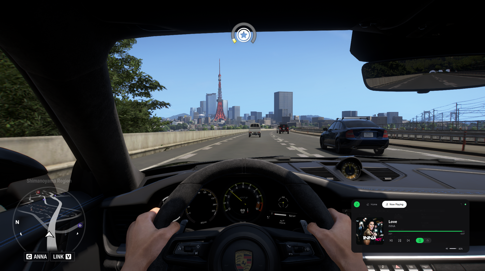
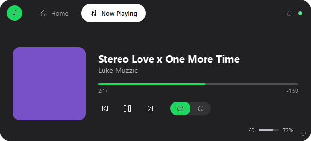
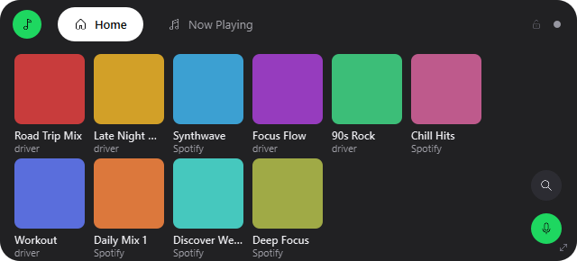

# Immersive In-Game Audio Bridge

A non-intrusive, telemetry-driven audio DSP overlay for **Forza Horizon 6** (Windows only). It reads live game telemetry over UDP, dynamically reshapes your background music to sound like it's playing through the car's own radio — muffled highs at low speed, cabin resonance, RPM-reactive ducking — and renders a CarPlay-style Spotify panel on top of the game. No game files are modified, no anti-cheat-risky memory reading involved.

<p align="center">
  
  <br />
  <em>Running live over real gameplay — telemetry-driven DSP + the overlay, both active.</em>
</p>

<p align="center">
  
  &nbsp;&nbsp;
  
</p>

## What it does

- **In-car DSP.** Live FH6 telemetry (speed, RPM, gear, pause/menu state) drives a real-time [pedalboard](https://github.com/spotify/pedalboard) effects chain: road-noise-grounded EQ, cabin-gain correction, an ITU-T-standard "through the wall" menu/pause effect, and continuous RPM-reactive gain ducking + filter modulation — all research-grounded, not guessed (see [docs/DECISIONS.md](docs/DECISIONS.md) for the sourcing).
- **CarPlay-style overlay.** A frameless, translucent, always-on-top panel: a Now Playing screen (album art, transport controls, progress) and a scrollable playlist grid, styled after Apple CarPlay's actual Spotify screens. Real system icons ([Segoe Fluent Icons](https://learn.microsoft.com/en-us/windows/apps/design/style/segoe-fluent-icons-font)), not custom art.
- **Never pauses the game.** The overlay window never takes keyboard focus (`WS_EX_NOACTIVATE`), so tapping a control doesn't alt-tab FH6 into its pause menu. (Requires FH6 running windowed/borderless — exclusive fullscreen unavoidably minimizes on any focus change, regardless of what any overlay does.)
- **Movable, resizable, lockable.** Drag to reposition, drag the corner grip to resize (aspect-locked, scales as one piece), and a global hotkey (`Ctrl+Alt+L`) locks placement without disabling the UI — taps keep working either way.
- **Spotify playback control.** Play/pause/skip, playlist browsing and selection, and volume control (`Page Up`/`Page Down`, global — works regardless of window focus) via the Spotify Web API.
- **In-Car / Regular toggle.** A pill switch to turn the driving DSP coloration on or off without touching the menu/pause effect.

## How it works

```
FH6 (UDP telemetry) ──► telemetry/parser.py ──► shared state ──► dsp/chain.py ──► audio/playback.py
                                                       ▲                              ▲
                                                  overlay reads              audio/capture.py
                                                       │                     (loopback capture,
                                                overlay/window.py             via VB-Cable)
                                              (Spotify + telemetry HUD)
```

Telemetry is the only writer to the shared state; DSP and the overlay are both readers, decoupled from each other. Full breakdown in [docs/ARCHITECTURE.md](docs/ARCHITECTURE.md).

## Requirements

- **Windows 10/11.** The overlay relies on Windows-specific APIs: the System Media Transport Controls (`winsdk`) for track info, and the `Segoe Fluent Icons` font for overlay icons.
- **Python 3.11+**
- **[VB-Cable](https://vb-audio.com/Cable/)** (free) — routes Spotify's audio into this app for DSP processing, without touching game SFX.
- **Forza Horizon 6**, with [Data Out telemetry](https://support.forza.net/hc/en-us/articles/51744149102611-Forza-Horizon-6-Data-Out-Documentation) enabled.
- *(Optional)* A [Spotify Developer app](https://developer.spotify.com/dashboard) Client ID, for the playlist browser / transport controls / volume. Track info and DSP work without this.

## Setup

1. **Clone and install dependencies:**
   ```bash
   git clone https://github.com/X3I-Inc/audio-bridge.git
   cd audio-bridge
   pip install -r requirements.txt
   ```

2. **Install [VB-Cable](https://vb-audio.com/Cable/)**, then set Spotify's output device to `CABLE Input (VB-Audio Virtual Cable)`. Your other system audio (game SFX, etc.) stays on your normal output device.

3. **Enable FH6's Data Out telemetry**: in-game, `Settings → HUD and Gameplay → Data Out` → On, set the IP to this PC's local IP and the port to `20127`.

4. *(Optional, for playlist browsing/volume/transport controls)* Create a [Spotify Developer app](https://developer.spotify.com/dashboard) with redirect URI `http://127.0.0.1:8888/callback`, and grab its Client ID — no client secret needed (uses PKCE).

5. **List your audio devices** to find the right names for step 6:
   ```bash
   python main.py --list-devices
   ```

6. **Run it:**
   ```bash
   python main.py --input "CABLE Output" --output "<your headphones/speakers>" \
       --telemetry-host 0.0.0.0 --spotify-client-id YOUR_CLIENT_ID
   ```
   Drop `--spotify-client-id` to skip Spotify integration (DSP + overlay track info still work via Windows' media session). Add `--mock` to test the whole pipeline without the game running, using a simulated telemetry sender.

## Controls

| Action | How |
|---|---|
| Move the overlay | Click and drag |
| Resize | Drag the bottom-right corner grip |
| Lock/unlock placement | `Ctrl+Alt+L` (global — works regardless of focus) |
| Volume up/down | `Page Up` / `Page Down` (global) |
| Switch tabs | Tap Home / Now Playing |
| Play a playlist | Tap a tile on the Home tab |
| In-Car / Regular DSP | Tap the pill switch next to the transport controls |

## Project layout

- `telemetry/` — UDP listener + parser for FH6's 324-byte telemetry packet, plus a mock sender for testing without the game.
- `audio/` — loopback capture and low-latency playback.
- `dsp/` — acoustic presets and the real-time effects chain.
- `overlay/` — the CarPlay-style window, now-playing polling (Windows SMTC), and global hotkeys.
- `spotify/` — Spotify Web API OAuth (PKCE) and client for playlists/transport/volume.
- `scripts/` — standalone tools used during development (raw telemetry capture/diffing, overlay layout preview, icon glyph verification).
- `docs/` — architecture, decision log (with rationale/sourcing for the DSP tuning and UI choices), open questions, and build status.

## Known limitations

- **Exclusive fullscreen** unavoidably steals focus on any window change — run FH6 windowed or borderless for the overlay's "never pauses the game" behavior to hold.
- **No dashboard-lock yet.** The overlay is a fixed 2D panel you position once; it doesn't track the in-game camera, since FH6 doesn't broadcast look-angle over telemetry. See `docs/OPEN_QUESTIONS.md` for the planned approach (free-look input tracking).
- **Per-app audio isolation** depends on VB-Cable being set up correctly (Spotify's output routed to `CABLE Input`) — it's been validated against real gameplay, but it's a manual one-time setup step per machine.
- **Spotify's Web API rate limits are real.** Playlist/volume data is deliberately polled conservatively; see `docs/DECISIONS.md` if you're modifying `spotify/`.

## License

MIT — see [LICENSE](LICENSE).
